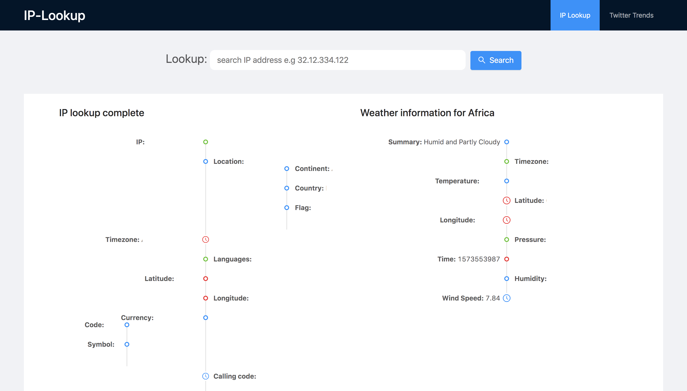
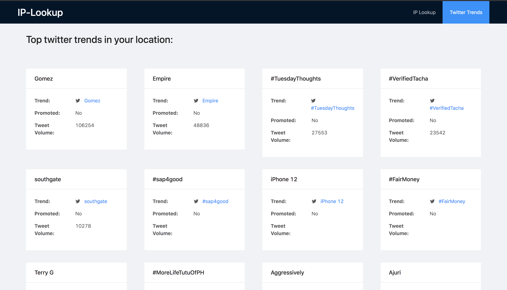

<h1 align="center">IP lookup</h1>
<p align="center">
A simple Vue application that helps you retrieve and display information about your IP address.
This app leverages the IPdata platform https://ipdata.co/ to get the IP information.
The retrieved IP information is also used to retrieve weather and twitter trend information based on the location from your IP.
</p>

<p align="center">
  
  <br>
  <br>
  
</p>

---

# Table of Contents
* [Demo](https://github.com/Nedson202/IP-lookup#demo)
* [Features](https://github.com/Nedson202/IP-lookup#features)
* [Technologies](https://github.com/Nedson202/IP-lookup#technologies)
* [Installation Setup](https://github.com/Nedson202/IP-lookup#installation-setup)
* [Language](https://github.com/Nedson202/IP-lookup#language)
* [Dependencies](https://github.com/Nedson202/IP-lookup#dependencies)
* [License](https://github.com/Nedson202/IP-lookup#license)

## Demo
Here is a working live demo: https://ip-web-lookup.herokuapp.com

## Features
* Get IP address information
* Get weather information from IP
* Get twitter trends by location from IP
* Search functionality to get information on other IP addresses

## Technologies
* Vue
* Ant Design Vue
* Node.js
* Express
* IPData
* Dark-sky API
* Twitter API

## Installation Setup
```
consumer_key
consumer_secret
access_token_key
access_token_secret

https://developer.twitter.com/en/apps - create an app and get the tokens above
```

```
ip_data_key - Checkout https://ipdata.co for guide on how to get an API key
```

```
DARKSKY_API - https://darksky.net/dev
```

```
NODE_ENV - production, development...
PRODUCTION_URL
PORT - Specify a different port for the server. Defaults to 4000
```

* **Clone repo:**

  Open **CMD** for windows users, or any other terminal you use.

  ```
    git clone https://github.com/Nedson202/IP-lookup
  ```

* **Install project dependencies:**

  This codebase uses the yarn package manager.

  Enter the following on your Terminal/CMD to change into the directory of the cloned repo and install all app dependencies

  ```
    Install the yarn package manager if you don't have it(optional).

    $ npm i -g yarn


    Change directory to cloned repo (IP-lookup)

    $ cd IP-lookup

    Install all dependencies

    $ yarn
  ```


* **Start the app:**
  
  **Note:** In order to properly test, you would need to use ngrok or a similar service to assign you a remote host since localhost doesn't exactly give a searchable remoteAddress which can be sent to IPData.

  Enter the following on your terminal/cmd to start the app
  ```
    $ yarn start-all
  ```

* **Open browser**

  ```
    Navigate to http://localhost:4000 on the browser
  ```

* **Additional setup:** This app uses the dotenv package to load environment variables. For more info visit [dotenv](https://www.npmjs.com/package/dotenv).

  * Create a .env file in the root directory of the codebase
  * Copy the content of the .env-sample file and add their corresponding values appropriately.

## Language
* Javascript

## Dependencies
> Click [here](https://github.com/Nedson202/IP-lookup/blob/develop/package.json) to view all dependencies.

## License

> You can check out the full license [here](https://github.com/Nedson202/IP-lookup/blob/develop/LICENSE)

This project is licensed under the terms of the MIT license.

